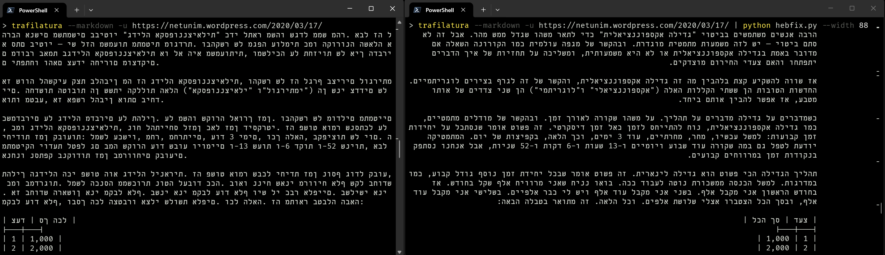

# HebFix
Write visual RTL Hebrew from files/stdin to stdout even when RTL isn't supported.
Supports:
- Markdown formatting
- Mixed RTL and LTR text
- Works with Windows Terminal, cat, bat, and vim

